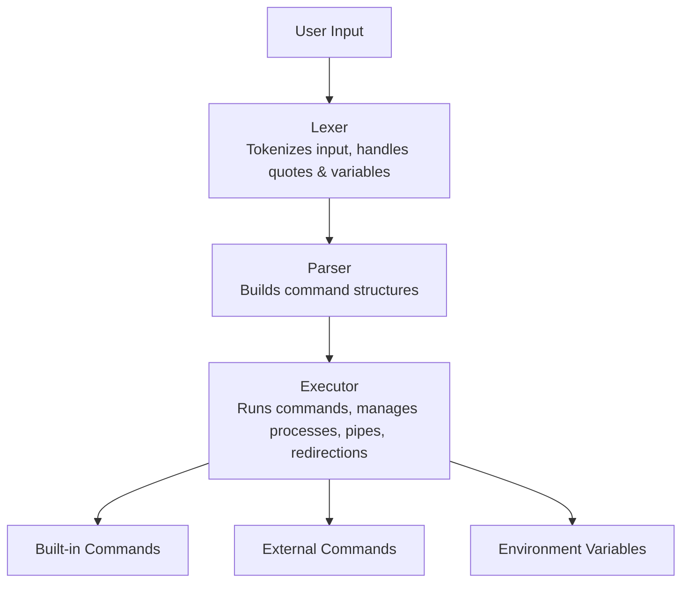

# borsh


Borsh is a minimalistic Unix shell 🥣, designed for educational purposes and to provide a hands-on understanding of shell internals. It supports core shell features such as command parsing, environment variable management, built-in commands, pipelines, redirections, and signal handling.


## ✨ Features

- Command execution with arguments and environment variables
- Built-in commands: `cd`, `echo`, `env`, `exit`, `export`, `pwd`, `unset`
- Pipelines (`|`) and redirections (`>`, `<`, `>>`, `<<`)
- Quoting (single `'`, double `"`) and variable expansion (`$VAR`)
- Heredoc support (`<<`)
- Signal handling (e.g., Ctrl+C, Ctrl+D)
- Custom memory management and utility functions
- Error handling and informative messages
- Modular codebase for easy extension

## 🗂️ Project Structure

- `src/` – Main source code
  - `builtins/` – Implementation of shell built-in commands
  - `execution/` – Command execution, process handling, redirections, signals
  - `lexer/` – Lexical analysis: tokenization, quotes, variable expansion
  - `parser/` – Parsing tokens into executable structures
  - `env_utils.c`, `utils.c`, `main.c` – Core logic and utilities
- `libft/` – Custom standard library functions (string, memory, list, etc.)
- `include/` – Header files for all modules

## 🏗️ Components Overview

- **Lexer:** Splits input into tokens, handles quotes and variable expansion
- **Parser:** Builds command structures from tokens
- **Executor:** Runs commands, manages processes, handles redirections and pipes
- **Builtins:** Implements shell built-in commands
- **Environment:** Manages shell environment variables
- **Signals:** Handles user interrupts and process signals
- **Libft:** Provides custom implementations of standard C functions



## 🚀 Getting Started

1. Clone the repository:
   ```sh
   git clone https://github.com/vkhvostov/borsh.git
   cd borsh
   ```
2. Build the project:
   ```sh
   make
   ```
3. Run the shell:
   ```sh
   ./borsh
   ```

## 📝 Usage

Type commands as you would in a typical Unix shell. Use built-in commands or execute binaries available in your system’s `PATH`.

## 🚧 Missing Features and Known Bugs

As with any software, this project is not perfect and has some limitations.

**Known missing features:**

- Handling of directories with spaces in the name, e.g., `cd Program Files`
- Pattern matching / wildcards (globbing)
- Error messages for multiple piped commands may differ from those in Unix bash
- Support for flags/options for built-in functions
- And probably much more

## 🤝 Contributing

It is just an educational project. Feel free to open an issue or pull request, but I can not promise to address it.

## 📄 License

This project is licensed under the MIT License.

---
